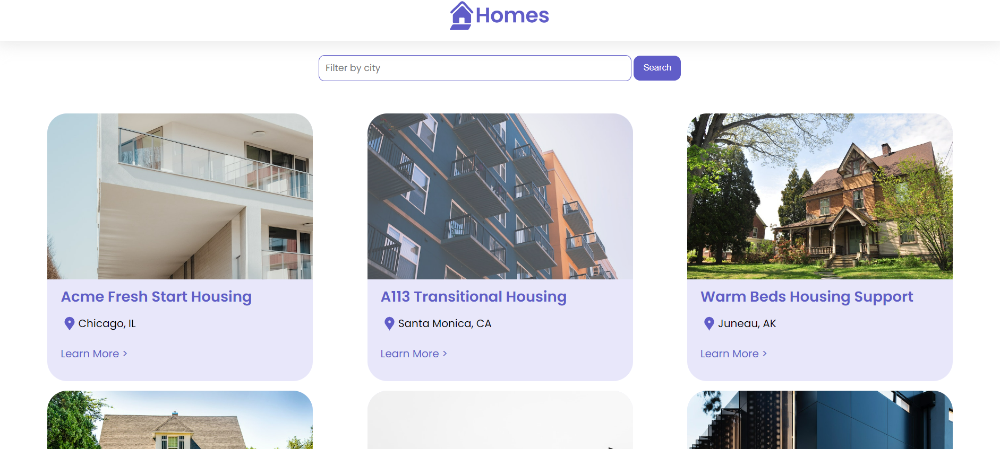

# Meet your Home

## Descrição

Uma aplicação web simples desenvolvida em Angular para auxiliar na busca de imóveis. O usuário pode filtrar os resultados por cidade e visualizar informações básicas sobre cada propriedade.



## Funcionalidades

- Busca por Cidade: Permite filtrar os resultados de acordo com a cidade desejada.
- Detalhes do Imóvel: Exibe informações como nome do imóvel e cidade.
- Botão "See More": Possibilidade de obter mais detalhes sobre cada imóvel.

## Tecnologias Utilizadas

- **Angular**: Framework front-end para desenvolvimento web.
- **TypeScript**: Linguagem de tipagem estática para JavaScript.
- **HTML**: Estruturação das páginas.
- **CSS**: Estilização da interface.

## Rodar projeto localmente

Node.js e npm (ou yarn): Para gerenciar as dependências do projeto.Para editor de código, recomenda-se o Visual Studio Code.

Clone o repositório:

```
git clone https://es.wiktionary.org/wiki/removido
```

Instale as dependências:

```
cd meet-your-home-angular
npm install
```

Inicie o servidor de desenvolvimento:

```
ng serve
```

Acesse http://localhost:4200/
